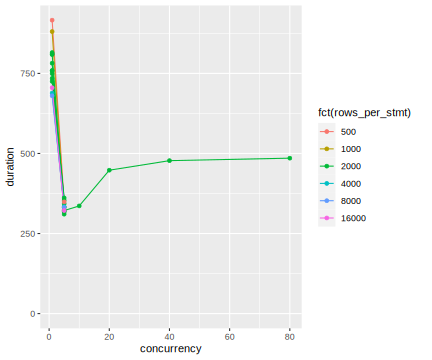
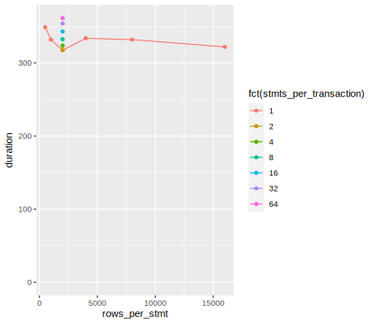

# Results

## Environment

The benchmark was executed directly on a host in the same network as the database server, both hosts with no significant other load.
The database server is running version 10.5.16 of MariaDB with default configuration, meaning only the InnoDB buffer pool has a size of 128 MiB and the log file a size of 96 MiB.
The database host has 251 GiB of memory and two 10-core processors adding up to 40 cores with hyper-threading enabled.
Database data files are stored on a hardware RAID10 with 4 HDDs and a 2 GiB on-chip cache.

## Execution

The `./bench.sh` script was used for performing multiple runs and collecting results.
The CSV was enriched with some further information (number of inserted rows, buffer size & log file size configured in MariaDB).

After an initial exploratory set of parameter combinations looking at each parameter individually, an additional targeted set of parameter combinations was derived and executed.

For all execution, the first 50 M rows (totalling 8.16 GiB) of a filelist from a synthetic dataset was used.

## Evaluation

An immediate observation is that a concurrency of 5 is clearly the best among the attempted values.

Looking specifically at a concurrency of 5, about 2000 rows per statement is a local minimum.
Packing a significant number of rows into a single `INSERT` statement is key to reduce statement processing overhead (SQL parsing, improved plan for queries).

The plot also shows that a very small number of statements per transaction works best.
A transaction size of 1 seems to be a good choice.
Monotonically decreasing performance with increasing transaction size is also visible in further plots (not included here).

A reason for deteriorating performance for increasing concurrency/rows per statement/statements per transaction may be the small size of the buffer and log file.
If the amount of open/uncommitted row data gets large, MariaDB may have to move data to disk before it is optimal to do so.
However, a decrease in performance for the chosen parameters with a larger buffer and log file is unlikely, so they.
